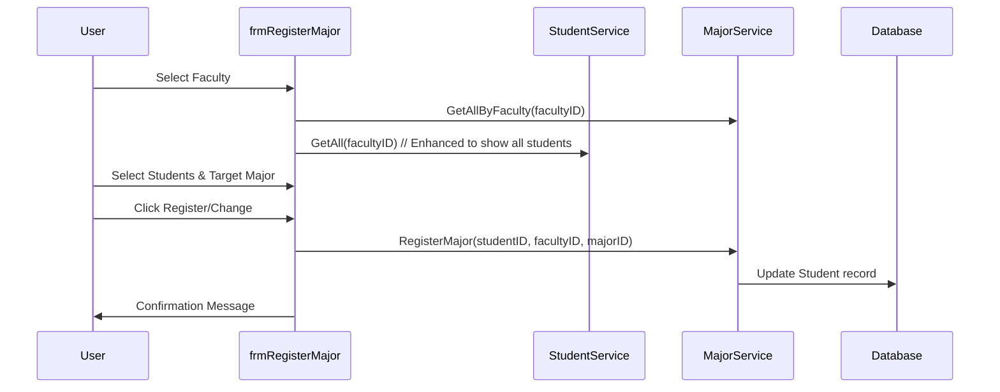

# Design: Complete Major Management

## Architecture
The system follows the existing 3-layer architecture:
1. **DAL**: `StudentModel` (EF) already contains the `Majors` DbSet.
2. **BUS**: `MajorService` will be expanded to include `InsertUpdate`, `Delete`, and `FindById`.
3. **GUI**: A new form `frmMajor` will handle CRUD, and `frmRegisterMajor` will be refactored to support all student listings.

## Data Flow - Major Assignment

## UI/UX Improvements
- **Sidebar Integration**: The Sidebar in `frmMain` will get a new button "Quản lý Chuyên ngành".
- **Dynamic Filtering**: `frmRegisterMajor` will include a CheckBox "Chỉ hiện sinh viên chưa có chuyên ngành" (default checked) to maintain legacy behavior while allowing "Change Major" when unchecked.
