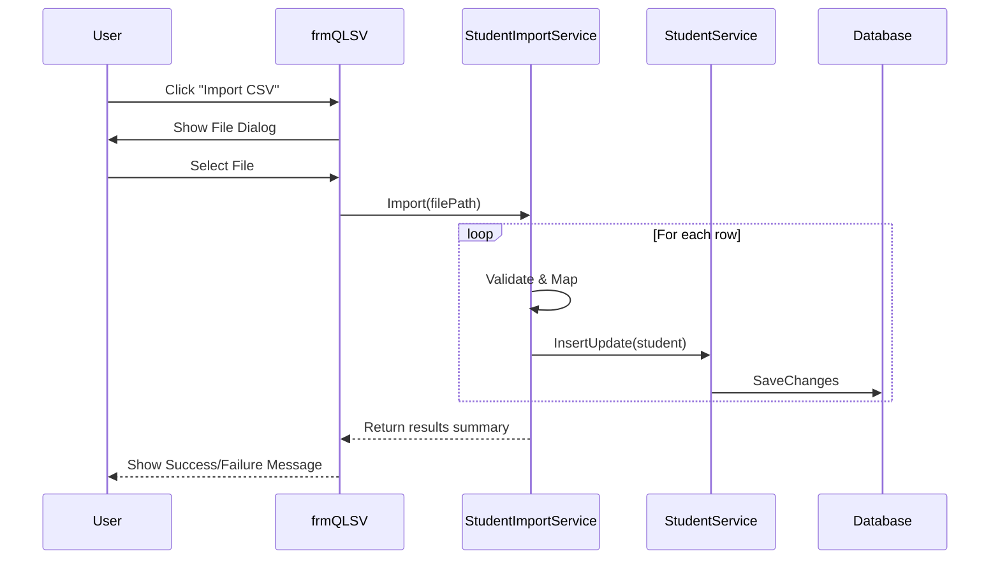

# Design: Import Student Data from CSV

## Architectural Approach

### 1. Service Layer
- **`StudentImportService`**: A new class in `Lab05.BUS` responsible for the import logic.
- It will depend on `StudentService` (for saving), `FacultyService`, and `MajorService` (for lookup).

### 2. Data Flow
1. User selects a `.csv` file via `OpenFileDialog`.
2. `StudentImportService` reads the file line by line.
3. For each line:
    - Parse CSV fields (MSSV, Name, Faculty, GPA, Major, BirthDate, Gender, Address, Phone).
    - Look up `FacultyID` by name.
    - Look up `MajorID` by name (if provided).
    - Validate field formats.
4. Call `studentService.InsertUpdate()` for each valid student.
5. Collect results (success/failure) and return to GUI.

### 3. UI/UX Changes
- **`frmQLSV`**: Add a button "Import CSV" next to "Xuất Excel (CSV)".
- Show a `MessageBox` summary after the operation.

## Component Interactions

