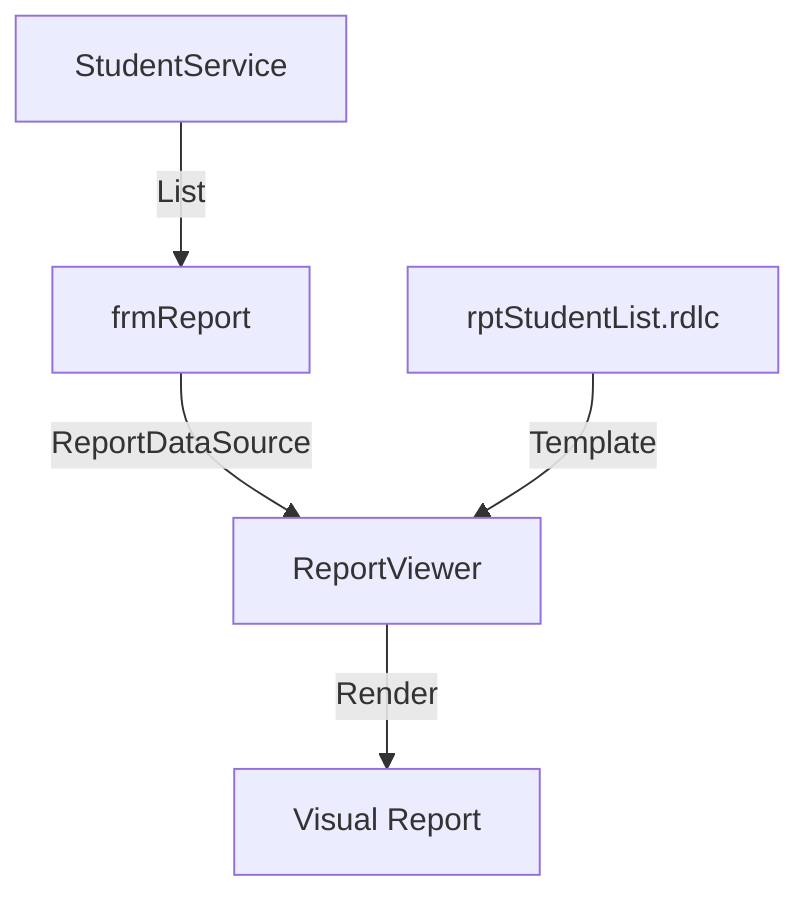

# Design: Professional Student Reporting with RDLC

## Architectural Approach

### 1. Presentation Layer
- **`frmReport`**: A new Windows Form containing the `Microsoft.Reporting.WinForms.ReportViewer` control.
- **`rptStudentList.rdlc`**: A Report Definition file containing the layout (Table, Header, Footer, Logo).

### 2. Data Access & Mapping
- The report will use a **Local Data Source**.
- I will create a View Model or use the existing `Student` entity class as the object data source for the report designer.
- Data will be fetched via `StudentService.GetAll()` or `StudentService.GetAll(facultyID)`.

### 3. Detailed Data Flow
1. User clicks "Xuất Báo Cáo" in `frmMain` or `frmQLSV`.
2. `frmReport` is instantiated.
3. `StudentService` retrieves the required list of students.
4. The list is wrapped in a `ReportDataSource`.
5. `ReportViewer` renders the RDLC template using the data source.
6. The report is displayed in a print-preview style.

## UI/UX Design
- The report will include a professional header: "DANH SÁCH SINH VIÊN".
- Columns: MSSV, Họ Tên, Khoa, Điểm TB, Ngày Sinh, Giới Tính, Chuyên Ngành.
- Footer: Page numbers and generation date.

